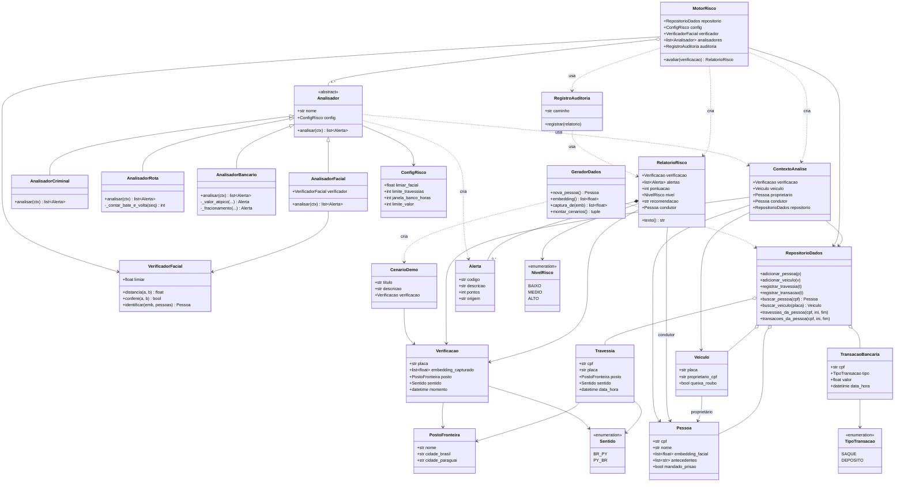

# Diagrama de Classes

Versão em imagem: [`diagrama_classes.png`](diagrama_classes.png) (também em [SVG](diagrama_classes.svg); fonte Graphviz em [`diagrama_classes.dot`](diagrama_classes.dot)).

A versão abaixo em Mermaid é renderizada automaticamente pelo GitHub.

## Decisões de projeto

- **Herança e polimorfismo:** `Analisador` é uma classe abstrata; cada regra de negócio é uma subclasse. O `MotorRisco` percorre a lista de analisadores sem saber qual é qual, então adicionar uma regra nova não exige alterar o motor.
- **Composição:** `RelatorioRisco` é composto por `Alerta`s, que não fazem sentido fora dele.
- **Agregação:** `RepositorioDados` guarda pessoas, veículos, travessias e transações, que existem independentemente dele.
- **Configuração centralizada:** `ConfigRisco` concentra pesos e limites (princípio de responsabilidade única).
